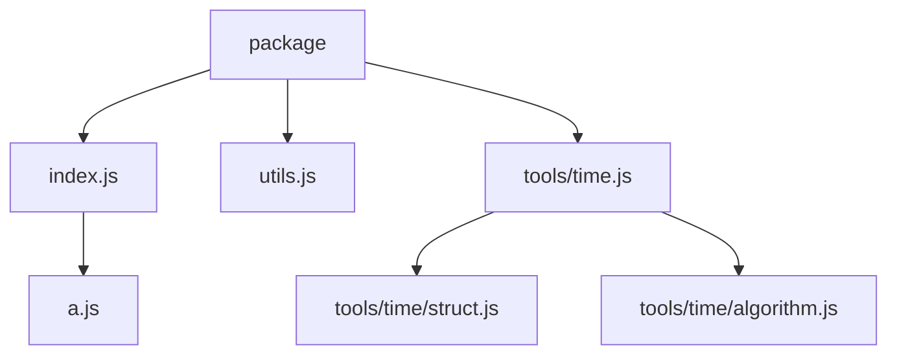

# ECMAScript Package Specification

## 简介

本文为 ECMAScript 制定了一种 Package 的组织规范。

该规范提供一系列符合直觉的约定，皆在提高包结构的一致性与可维护性，且利于编写自动化工具。

## 引言

该规范在 [ECMAScript Module Specification](https://tc39.es/ecma262/#sec-modules)、[Node.js Package Specification](https://nodejs.org/api/packages.html) 和 [JSDoc Specification](https://jsdoc.app/) 的基础上进行制定。

但是该规范只保证与 ECMAScript Module Specification 和 Node.js Package Specification 的兼容性，
如果与 JSDoc Specification 中的描述有冲突，则以本规范为准。

## 概念

### 包结构

Package 由一个或多个 Module 组成。

一个典型的 Package 目录结构如下：

```
package/
├── src/
│   ├── index.js
│   ├── utils/
│   │   ├── math.js
│   │   └── pool.js
│   ├── utils.js
│   └── config.js
└── package.json
```

### 根目录

Package 需要定义一个 Root Directory，默认为 `src` 目录。

### 索引模块

索引模块有两种定义方式：

- 同级同名模块：模块作为同级目录中同名子目录的 Index Module。
- `index` 模块：名称为 `index` 的模块称为该模块所在目录的 Index Module。

规则：

- 同个目录不允许同时存在多个索引模块。

除了在根目录中使用 `index` 模块之外，推荐使用同级同名模块来定义索引模块。

例如：

- `src/index.js` 是 `src` 目录的索引模块。
- `src/utils.js` 是 `src/utils/` 目录的索引模块。

### 术语

- 父模块/子模块：`export` 语句所在的模块和被该语句导出的模块构成父子模块关系。
- 父符号/子符号：符号间的包含关系，父符号为容器（如类、对象），子符号为其成员（如方法、属性）。

## 包可访问性

在文档注释中使用标记声明模块/符号的包可访问性。

包可访问性标记分为三种：

- `@public` - 公开，可被任何包访问。
- `@internal` - 私有，不可被其它包访问，仅在自身包内可访问。
- `@unspecified` - 未指定，不能直接访问，但可通过公开的父模块访问。

标记规则：

- 不存在任何包可访问性标记时，模块会被视为 `@unspecified`，符号会被视为 `@public`。
- `@unspecified` 标记不允许显式声明，应通过保持无标记的方式来实现。
- 模块的包可访问性只取决于其自身的标记。
- 符号最终是否可访问取决于其所在的模块、父级符号、符号本身的可访问性（受限于最严格的层级）。

例如：

`src/utils.js`

```js
export const value = 1;

/**
 * @internal
 */
export const internalValue = 2;
```

`src/index.js`

```js
/**
 * This is a useful module.
 *
 * @public
 * @module
 */

export * from "./utils.js";
```

- `index.js` 模块被公开，任何包都可以访问。
- `utils.js` 模块未指定可访问性，未直接公开，但可以通过 `index.js` 这个公开模块访问。
- `value` 符号未指定可访问性，视为公开，其所在模块虽然未指定可访问性，但可通过公开的父模块 `index.js` 访问。
- `internalValue` 符号被标记为私有，即使是通过公开的父模块 `index.js` 也无法访问。

注意不要混淆 "包可访问性" 与导出语句 `export`，导出不意味着其它包可以访问。

当包可访问性为公开时，也意味着 `package.json` 存在相应的导出声明。

例如，含有上面两个模块的包可能会存在以下内容：

`src/entrypoint/index.js`

```js
export { value } from "../src/index.js";
```

`package.json`

```json
{
  "name": "my-package",
  "type": "module",
  "exports": {
    ".": "./src/entrypoint/index.js"
  }
}
```

- 其它包可以通过 `my-package` 包访问 `value` 符号，但无法访问 `internalValue` 符号。
- 为了保证正确的包可访问性，可能会存在类似 `src/entrypoint/index.js` 的入口模块。
- 以上内容均可由构建工具自动生成，路径和文件名并非规范要求，可自行决定。

## 包访问路径

默认情况下，以公开模块中根目录下不带文件扩展名的相对路径作为访问路径，如果该模块是索引模块，则使用其对应的目录名称。

例如：

- `src/index.js` -> `my-package`
- `src/tools/math.js` -> `my-package/tools/math`
- `src/utils.js` -> `my-package/utils`

可通过 `@module <module-path>` 自定义访问路径。

例如：

`src/tools/math.js`

```js
/**
 * This is a useful module.
 *
 * @public
 * @module math
 */
```

生成的 `exports` 声明为：

```json
{
  "exports": {
    "./math": "./src/tools/math.js"
  }
}
```

## 可选特性

### 特殊模块标识符

#### `esp:submodules:<module-path>`

该标识符用于指代在该路径的索引模块所对应的目录内所有未指定包可访问性的同级模块。

例如：

```
package/
├── src/
│   ├── tools/
│   │   ├── math/
│   │   │   ├── vec2.js
│   │   │   └── vec3.js
│   │   ├── math.js
│   │   ├── time/
│   │   │   ├── struct.js
│   │   │   └── algorithm.js
│   │   └── time.js           - `@public`
│   ├── tools.js              - `@internal`
│   ├── others/
│   │   ├── b.js
│   │   └── c.js
│   ├── utils.js              - `@public`
│   ├── a.js
│   └── index.js              - `@public`
└── package.json
```

如果所有索引模块都使用 `export * from "esp:submodules:<module-path>"` 导出语句。

那么对应地将映射成这样的包结构：



```json
{
  "exports": {
    ".": "./src/index.js",
    "./utils": "./src/utils.js",
    "./tools/time": "./src/tools/time.js"
  }
}
```

### 二进制入口

有些运行时允许你将模块声明为二进制入口，使其成为可执行命令。

在模块级别注释中使用 `@bin [<command-name>]` 标记声明模块作为二进制入口。

标记值作为可执行入口名称，视运行时决定该值是必填、可选、还是禁止指定值。

且单个模块可以同时存在多个不同标记值的 `@bin` 标记。

例如：

`bin.js`

```js
/**
 * This is a bin entrypoint.
 *
 * @bin cli
 */
```

对应 `Node.js` 运行时：

`package.json`

```json
{
  "bin": "./bin.js"
}
```

`Node.js` 默认可执行入口名称是包名，那么以下模块：

`bin.js`

```js
/**
 * This is a bin entrypoint.
 *
 * @bin
 * @bin build
 */
```

对应：

`package.json`

```json
{
  "name": "cli",
  "bin": {
    "cli": "./dist/bin.js",
    "build": "./dist/bin.js"
  }
}
```
